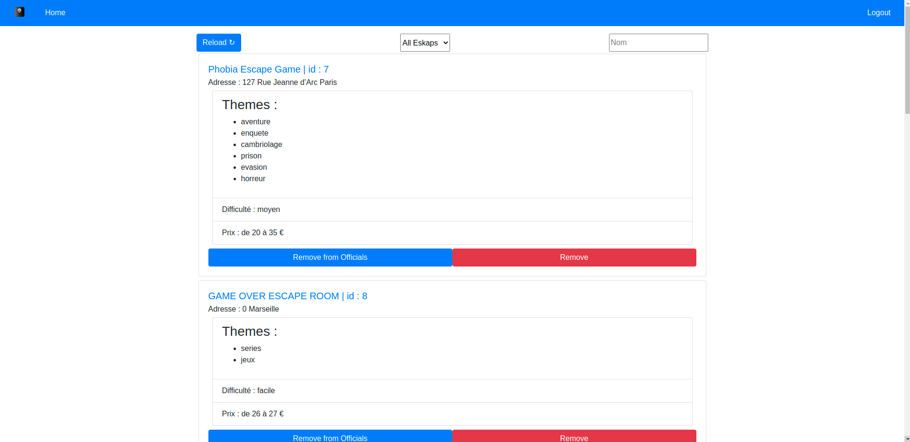
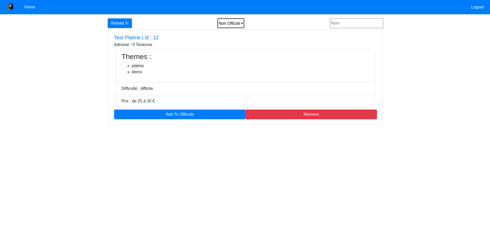
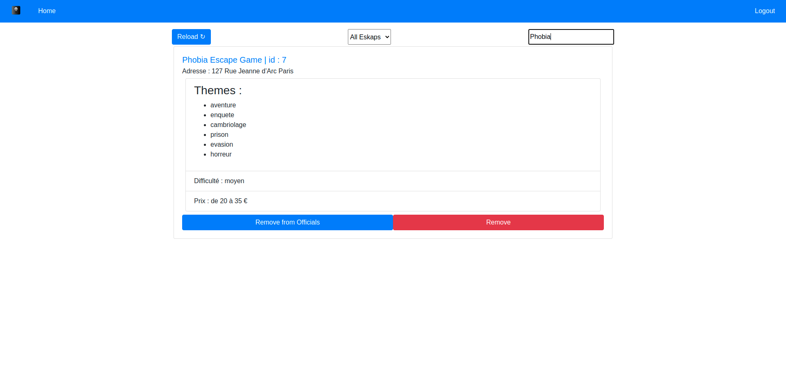
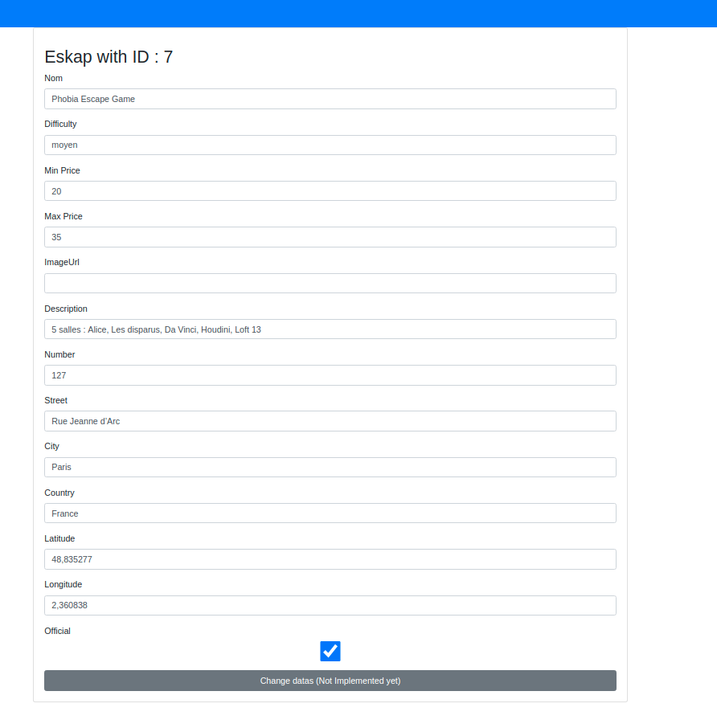

# Eskap React App

Antoine Méresse & Imad Abdelmouine

# Technos used

- React
- React Router
- Axios
- Firebase
- Bootstrap

# Start

- `npm install` : for dependencies
- `npm start` : to start the website on localhost

# Screenshots

## Login Screen

## Eskap List

## Eskap Filter (Non officials)

## Eskap Filter (Name)

## Eskap inspect or modify datas

This part is not finished, at the moment we can't modify datas. That's why bottom button is grey.

# More infos

# .env.local

Firebase Infos are in a local files to avoid uploading app infos on github.

## Navbar

The navbar doesn't show the same infos if we are login or not. (screenshots)

## Routes

We've created a Private route that checks if the user is login or not.
That means even if you enter `<<url/>>` you will be redirect to `<<url/login>>`

## Why no sign up page ?

This is a backend for our API, so we don't need to provide a way to sign up.

## What we need to improve ?

We need to add an admin role on firebase and check when the user login if he's an admin. If not he won't be able to view the site.

## Actual Problems :

We need to use a chrome extension to allow Cors request else Axios won't be able to get datas :'(
That's a problem coming from our API that we need to fix.
